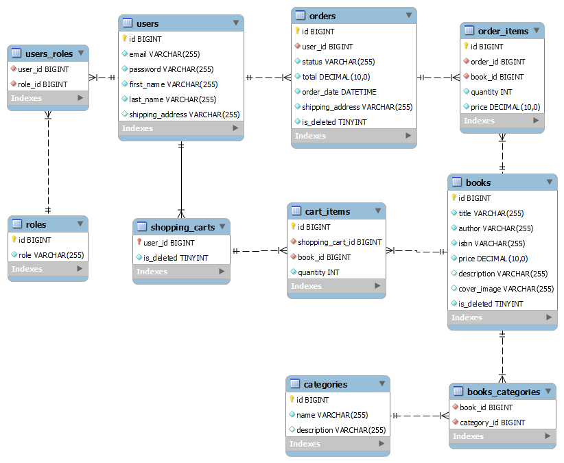

<h1>
 
</h1>

<p align="center">
  <a href="#introduction">Introduction</a>  •
  <a href="#technologies-used">Technologies used</a>  •
  <a href="#database-structure">Database structure</a>  •
  <a href="#project-controllers">Project controllers</a>  •
  <a href="#setup">Setup</a> •
  <a href="#run">Run</a> •
  <a href="#swagger">Swagger</a> •
  <a href="#postman-collection">Postman Collection</a> 
</p>

# Online Book store application

---
## Introduction

---
This  online book store application designed for management of books, categories, user's shopping
cart and orders.
User can find a book of his taste by specific parameters, add it to his shopping cart and arrange an order.

## Inspiration

---
With the rise of digital platforms, book stores have evolved to offer seamless online experiences for readers.
This project aims to replicate that experience.
The goal is to create a platform that not only serves readers but also provides a robust backend for book store administrators to manage their inventory and operations efficiently.

## 💡 Technologies used

---
- **Spring Boot**: Core framework for building an application.
- **Spring Boot Web**: Enables the development of RESTful web services and handles HTTP requests and responses.
- **Spring Security**:  Handles authentication and authorization.
- **Spring Data JPA**: Manages data access persistence.
- **Hibernate**: Default JPA implementation for ORM.
- **MySQL**: Primary relational database.
- **JWT(Provides JSON Web token)**:  Provides secure authentication.
- **Liquibase**: Manages database migrations.
- **Lombok**: Reduces boilerplate code.
- **Docker**: Containerization for deployment.
- **MapStruct**: Simplifies entity-to-DTO mappings.
- **Testcontainers**: Facilitates integration testing with Docker.
- **Swagger**: Generates and visualizes API documentation.

<div align="right"><kbd><a href="#online-book-store-application">↑ Back to top ↑</a></kbd></div>

## 🛢️ Database structure

---
<h1>
 
</h1>
<div align="right"><kbd><a href="#online-book-store-application">↑ Back to top ↑</a></kbd></div>

## Project controllers

---

Application supports two roles: `Admin` and `User`. `User` role is automatically assigned after registration.
If you want to assign an Admin role you have to create a Liquibase script or write SQL query.

### Authentication Controller

| Http method | Endpoint           | Description   | 
|-------------|--------------------|---------------|
| Post        | /auth/registration | Register User |
| Post        | /auth/login        | Login User    |

### Books Management

| Http method | Endpoint      | Description                    | 
|-------------|---------------|--------------------------------|
| Get         | /books        | Get all books                  |
| Get         | /books/{id}   | Get book by id                 |
| Get         | /books/search | Get books by params            |
| Delete      | /books/{id}   | Delete a book (ADMIN only)     |
| Post        | /books        | Create a new book (ADMIN only) |
| Put         | /books/{id}   | Update a book (ADMIN only)     |

### Categories Management

| Http method | Endpoint               | Description                        | 
|-------------|------------------------|------------------------------------|
| Post        | /categories            | Create a new category (ADMIN only) |
| Get         | /categories            | Get all categories                 |
| Get         | /categories/{id}       | Get category by id                 |
| Put         | /categories/{id}       | Update a category (ADMIN only)     |
| Delete      | /categories/{id}       | Delete a category (ADMIN only)     |
| Put         | /categories/{id}/books | Get all books with category        |

### Shopping Carts Management

| Http method | Endpoint                 | Description               | 
|-------------|--------------------------|---------------------------|
| Post        | /cart                    | Add book to shopping cart |
| Get         | /cart                    | Get shopping cart         |
| Put         | /cart/items/{cartItemId} | Update shopping cart      |
| Delete      | /cart/items/{cartItemId} | Delete cart item          |

### Order Managment

| Http method | Endpoint                | Description                 | 
|-------------|-------------------------|-----------------------------|
| Patch       | /orders/{id}            | Update order status         |
| Post        | /orders                 | Place an Order (ADMIN only) |
| Get         | /orders                 | Get Order history           |
| Get         | /orders/{orderId}/items | Get order details           |
| Get         | {orderId}/items/{id}    | Get order item"             |

<div align="right"><kbd><a href="#online-book-store-application">↑ Back to top ↑</a></kbd></div>

## ⚙ Setup

---
### Using 
1. Clone repository:
    ```bash
      git clone https://github.com/DojiDoe/jv-spring-boot-book-store.git
   ```
2. Navigate to project directory:
   ```bash
   cd book-store
    ```
3. Build a project:
    ```bash
    mvn clean install
    ```
4. Set up the .env.template file:
- Rename .env.template to .env.
- Fill in the required environment variables:
    ```bash
    MYSQLDB_USER=your_mysql_user
    MYSQL_ROOT_PASSWORD=your_mysql_root_password
    MYSQL_DATABASE=your_mysql_database
    MYSQL_LOCAL_PORT=your_mysql_local_port
    MYSQL_DB_DOCKER_PORT=your_mysql_docker_port
    SPRING_LOCAL_PORT=your_spring_local_port
    SPRING_DOCKER_PORT=your_spring_docker_port
    DEBUG_PORT=your_debug_port
   ```
## 🚀 Run 

---
### 🏚️ Locally
```bash
mvn spring-boot:run
```

### 🐳 Docker
1. Install Docker.
2. Create a Docker image:
    ```bash
   docker build -t book-store .
    ```
3. Run the Docker container:
    ```bash
   docker-compose up
    ```
4. The application will be accessible at http://localhost:SPRING_LOCAL_PORT (replace SPRING_LOCAL_PORT with the port you configured in .env).

<div align="right"><kbd><a href="#online-book-store-application">↑ Back to top ↑</a></kbd></div>

## Swagger API

---
You can access the [Swagger Ui](http://localhost:8080/swagger-ui/index.html#/) to explore the API endpoints, request/response models, and test the APIs interactively.

## Postman Collection

---
### For quick start:
   
- Open Postman and import [book store collection.](src/main/resources/postman/BookStore.postman_collection.json)
- Test API endpoints following included documentation.
> **Note:** Before testing endpoints make sure application is running, and you have stable coonnection to database.
<div align="right"><kbd><a href="#online-book-store-application">↑ Back to top ↑</a></kbd></div>
